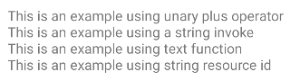

# Android Spantastic
 [](https://github.com/wellingtoncabral/android-spantastic/blob/main/LICENSE)  [](https://ktlint.github.io/)

Spantastic is an Android library that provides a simple and Kotlin fluent API for creating Android Spannable.
This library wrappers `SpannableStringBuilder` and add methods to easily decorate the text with multiple spans.

## Supported Spans:
`absoluteSize` `align` `background` `bold` `bullet` `clickable` `drawableMargin` `foreground` `iconMargin` `image` `italic` `leadingMargin` `lineHeight` `mask` `monospace` `quote` `relativeSize` `sansSerif` `scaleX` `serif` `strike` `style` `subscript` `superscript` `tab` `textAppearance` `typeface` `underline` `url`


## How to add
Step 1. Add the JitPack repository to your build file

```groovy
allprojects {
    repositories {
      ...
      maven { url 'https://jitpack.io' }
    }
}
```

Step 2. Add the dependency

#### Gradle:

```groovy
dependencies {
    implementation 'com.github.wellingtoncabral:android-spantastic:<LATEST-VERSION>'
}
```

#### Kotlin:

```kotlin
dependencies {
    implementation ("com.github.wellingtoncabral:android-spantastic:$LATEST_VERSION")
}
```

## How to use
Use the `spantastic{}` builder to decorate texts from the `SpantasticBuilder` context.
This method will return a `SpannableStringBuilder`.

```kotlin
val span = spantastic {

}
binding.textView.text = span
```

### Making text
You can make text in many more ways.

```kotlin
val span = spantastic {
    +"This is an example using unary plus operator\n"

    "This is an example using a string invoke\n" {
        // Add decorators
    }

    text("This is an example using text function\n") {
        // Add decorators
    }
}
binding.textView.text = span
```

It looks like:

<kbd>

</kbd>

### Adding decorators
To manipulate the text, add decorators inside the text block.
In the example below, mark the text with multiple decorators/spans.

```kotlin
val span = spantastic {
    "Text with bold, underline, absolute size, foreground, and background decorations" {
        bold()
        underline()
        foreground(Color.WHITE)
        background(Color.BLACK)
        absoluteSize(20)
    }
}
binding.textView.text = span
```

It looks like:

<kbd>

</kbd>

---
Note that the decorators are applied for a specific block of text. See an example:

```kotlin
val span = spantastic {
    + "Text with "
    "bold" {
        bold()
    }
    + ", "
    "relative size" {
        relativeSize(2f)
    }
    + ", "
    "absolute size" {
        absoluteSize(22)
    }
    + ", "
    "foreground" {
        foreground(Color.RED)
        absoluteSize(18)
    }
    + ", and "
    "background "{
        background(Color.MAGENTA)
        foreground(Color.WHITE)
        absoluteSize(18)
    }
    + "decorations."
}
binding.textView.text = span
```

It looks like:

<kbd>

</kbd>

---

If you prefer put full text first and then apply decorators, you can set up the `start` and `end` position. 
Take a look at these examples:

```kotlin
val span = spantastic {
    "By continuing, you agree to the Terms os Service and Privacy Policy." {
        url("https://www.google.com") {
            start = 32
            end = 48
        }

        url("https://github.com/wellingtoncabral") {
            start = 53
            end = 67
        }
    }

    newLine()
    newLine()

    "Text with italic and strike decorations." {
        bold {
            start = 10
            end = 16
        }
        strike {
            start = 21
            end = 27
        }
    }
}
binding.textView.text = span
```

It looks like:

<kbd>

</kbd>

### Creating extensions like components
You can create extension functions to build custom decoration components. 
In the example below, we created 3 custom components: `h1`, `title`, and `divider`.

```kotlin
fun SpantasticBuilder.h1(text: String) {
    text {
        bold()
        absoluteSize(20)
        align(Layout.Alignment.ALIGN_CENTER)
        divider()
    }
}

fun SpantasticBuilder.title(text: String, shouldBreakLine: Boolean = true) {
    text {
        bold()
        absoluteSize(10)
        if (shouldBreakLine) newLine()
    }
}

fun SpantasticBuilder.divider() {
    newLine()
    newLine()
}
```

So, you can use them easily like that:

```kotlin
val span = spantastic {
    h1("Clickable decorations")

    title("Url:")
    "Click here to open the url" {
        url("https:www.google.com.br") {
            start = 6
            end = 10
        }
    }

    divider()

    title("Clickable:")
    "Text with a clickable area" {
        clickable {
            Toast.makeText(this@MainActivity, "Text was clicked", Toast.LENGTH_SHORT).show()
        }
    }
}
binding.textView.text = span
```

It looks like:

<kbd>

</kbd>

### Initializing the spantastic
If you already have an instance of `SpannableStringBuilder`, you can pass it to the `spantastic` builder to be appended in the context.
For example, you can pass the `editText.text` as `SpannableStringBuilder` to the `spantastic` calling `asSpannableStringBuilder` like that:

```kotlin
binding.editText.text = spantastic(binding.editText.text.asSpannableStringBuilder()) {
    bold()
}
```

The bold decorator will be applied to the existing text in the EditText component.

### More examples
To see more implementations and use cases, please take a look at the sample app.\
https://github.com/wellingtoncabral/android-spantastic/tree/main/sample/src/main/java/com/wcabral/spantastic

### References
1. https://developer.android.com/reference/android/text/Spannable.html?utm_source=android-arsenal.com&utm_medium=referral&utm_campaign=6271
2. https://developer.android.com/guide/topics/text/spans#:~:text=Android%20categorizes%20spans%20in%20two,applied%20to%20an%20entire%20paragraph
3. https://medium.com/androiddevelopers/spantastic-text-styling-with-spans-17b0c16b4568


