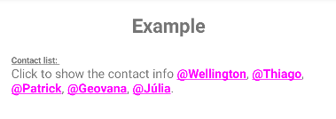

# Android Spantastic
 [](https://github.com/wellingtoncabral/android-spantastic/blob/main/LICENSE)  [](https://ktlint.github.io/)

Spantastic is an Android library that provides a simple and Kotlin fluent API for creating Android Spannable.
This library wrappers `SpannableStringBuilder` and add methods to easily decorate the text with multiple spans.

## Supported Spans:
`absoluteSize` `align` `background` `bold` `bullet` `clickable` `drawableMargin` `foreground` `iconMargin` `image` `italic` `leadingMargin` `lineHeight` `mask` `monospace` `quote` `relativeSize` `sansSerif` `scaleX` `serif` `strike` `style` `subscript` `superscript` `tab` `textAppearance` `typeface` `underline` `url`


## How to add
Step 1. Add the JitPack repository to your build file

```groovy
allprojects {
    repositories {
      ...
      maven { url 'https://jitpack.io' }
    }
}
```

Step 2. Add the dependency

#### Gradle:

```groovy
dependencies {
    implementation 'com.github.wellingtoncabral:android-spantastic:<LATEST-VERSION>'
}
```

#### Kotlin:

```kotlin
dependencies {
    implementation ("com.github.wellingtoncabral:android-spantastic:$LATEST_VERSION")
}
```

## How to use
Use the `spantastic{}` builder to decorate texts from the `SpantasticBuilder` context.\
This method will return a `SpannableStringBuilder`.

```kotlin
val span = spantastic {

}
binding.textView.text = span
```

### Adding text
You can make text in many more ways.

```kotlin
val span = spantastic {
    +"This is an example using unary plus operator\n"

    "This is an example using a string invoke\n" {
        // Add decorators
    }

    text("This is an example using text function\n") {
        // Add decorators
    }

    text(context, R.string.my_string) {
        // Add decorators
    }
}
binding.textView.text = span
```

It looks like:

<kbd>

</kbd>

### Adding decorators
To manipulate the text, add decorators inside the text block.\
In the example below, mark the text with multiple decorators/spans.

```kotlin
val span = spantastic {
    "Text with bold, underline, absolute size, foreground, and background decorations" {
        bold()
        underline()
        foreground(Color.WHITE)
        background(Color.BLACK)
        absoluteSize(20)
    }
}
binding.textView.text = span
```

It looks like:

<kbd>

</kbd> <br /> <br />

Note that the decorators are applied for a specific block of text. See an example:

```kotlin
val span = spantastic {
    + "Text with "
    "bold" {
        bold()
    }
    + ", "
    "relative size" {
        relativeSize(2f)
    }
    + ", "
    "absolute size" {
        absoluteSize(22)
    }
    + ", "
    "foreground" {
        foreground(Color.RED)
        absoluteSize(18)
    }
    + ", and "
    "background "{
        background(Color.MAGENTA)
        foreground(Color.WHITE)
        absoluteSize(18)
    }
    + "decorations."
}
binding.textView.text = span
```

It looks like:

<kbd>

</kbd> <br /> <br />

If you prefer put full text first and then apply decorators, you can set up the `start` and `end` position. <br />
Let's take a look at this example that draws the molecular formula of caffeine:

```kotlin
val span = spantastic {
    // Example using custom positions
    "☕- C8H10N4O2" {
        subscript {
            start = 4
            end = 5
        }
        subscript {
            start = 6
            end = 8
        }
        subscript {
            start = 9
            end = 10
        }
        subscript {
            start = 11
            end = 12
        }
    }    
}
binding.textView.text = span
```

In the same way without custom positions:

```kotlin
val span = spantastic {
    + "☕- C"
    "8" { subscript() }
    + "H"
    "10" { subscript() }
    + "N"
    "4" { subscript() }
    + "O"
    "2" { subscript() }    
}
binding.textView.text = span
```

It looks like:

<kbd>

</kbd>

## Creating extensions like components
You can create extension functions to build custom decoration components.\
In the example below, we created 3 custom components: `h1`, `title`, `divider`, and `contactList`.

```kotlin
fun SpantasticBuilder.h1(text: String) {
    text {
        bold()
        absoluteSize(22)
        align(Layout.Alignment.ALIGN_CENTER)
        divider()
    }
}

fun SpantasticBuilder.title(text: String, shouldBreakLine: Boolean = true) {
    text {
        absoluteSize(10)
        underline()
        bold()
        if (shouldBreakLine) newLine()
    }
}

fun SpantasticBuilder.divider() {
    newLine()
    newLine()
}

fun SpantasticBuilder.contactList(
    vararg contacts: String,
    onClick: (String) -> Unit
) {
    contacts.forEachIndexed { index, contact ->
        "@$contact" {
            clickable { onClick(contact) }
            bold()
            foreground(Color.MAGENTA)
        }
        if (index < contacts.size-1) + ", " else + "."
    }
}
```

So, you can use them easily like that:

```kotlin
val span = spantastic {
    h1("Example")

    title("Contact list: ")

    + "Click to show the contact info "
    contactList("Wellington", "Thiago", "Patrick", "Geovana", "Júlia") { contact ->
        showContactInfo(contact)
    }
    
    divider()
}
binding.textView.text = span
```

It looks like:

<kbd>

</kbd>

## Initializing the spantastic with a known text
If you already have an instance of `SpannableStringBuilder`, you can pass it to the `spantastic` builder to be appended in the context. For example, you can pass the `editText.text` as `SpannableStringBuilder` to the spantastic calling `asSpannableStringBuilder` like that:

```kotlin
binding.editText.text = spantastic(binding.editText.text.asSpannableStringBuilder()) {
    bold()
}
```

The `bold` decorator will be applied to the existing text in the EditText component.

## Show case

### Adding clickable areas
Spantastic provides 2 ways to work with clickable areas: `url` and `clickable`.
Take a look in this simple example:

```kotlin
val span = spantastic {
    "Text with url" {
        url("https://github.com/wellingtoncabral")
    }

    newLine()

    "Text with clickable area" {
        clickable(isUnderlineText = true) {
            showActivity()
        }
    }
}
binding.textView.text = span
```

It looks like:

<kbd>

</kbd><br /><br />

The first example uses `url` to open the brownser with the given url and the second one uses `clickable` which invokes the lambda method, in this case `showActivity()`.

Let's take a look in a real use case:

```kotlin
val span = spantastic {
    "By continuing, you agree to the Terms os Service and Privacy Policy." {
        url("https://github.com/wellingtoncabral") {
            start = 32
            end = 48
        }

        clickable(
            isUnderlineText = true,
            init = {
                start = 53
                end = 67
            }
        ) {
            showActivity()
        }
    }
}
binding.textView.text = span
```

It looks like:

<kbd>

</kbd>

### Adding images
Spantastic provides many ways to add images.

```kotlin
val span = spantastic {
    "Text with image from resource id " {
        image(context, R.drawable.ic_android, DynamicDrawableSpan.ALIGN_BASELINE)
    }
    
    newLine()
    
    "Text with image " {
        image(context, bitmap, DynamicDrawableSpan.ALIGN_CENTER)
    }
    
    + " from the Bitmap "       
}
binding.textView.text = span
```

It looks like:

<kbd>

</kbd> <br /> <br />

See also `drawableMargin` and `iconMargin`.

### Adding Android Style Resource
Use the `textAppearance` to set up a Android style resource.

```kotlin
val span = spantastic {
    "Text with a custom appearance" {
        textAppearance(context, R.style.CustomStyle)
    } 
}
binding.textView.text = span
```

```xml
<resources>
    <style name="CustomStyle">
        <item name="android:textColor">@color/teal_700</item>
        <item name="android:textSize">18sp</item>
        <item name="android:textStyle">bold|italic</item>
    </style>
</resources>
```

It looks like:

<kbd>

</kbd>

### Adding alignments

```kotlin
val span = spantastic {
    "Text with normal alignment" {
        align(Layout.Alignment.ALIGN_NORMAL)
    }
    
    newLine()
    
    "Text with center alignment" {
        align(Layout.Alignment.ALIGN_CENTER)
    }
    
    newLine()
    
    "Text with opposite alignment" {
        align(Layout.Alignment.ALIGN_OPPOSITE)
    }
}
binding.textView.text = span
```

It looks like:

<kbd>

</kbd> 

### Adding custom fonts

```kotlin
val span = spantastic {
    val myTypeface = Typeface.create(
        ResourcesCompat.getFont(contexxt, R.font.aguafina_script), Typeface.NORMAL
    )
    "Text with a custom typeface" {
        typeface(myTypeface)
        absoluteSize(24)
    }   
}
binding.textView.text = span
```

It looks like:

<kbd>

</kbd>

### Adding mask

```kotlin
val span = spantastic {
    "Text with a blur mask and absolute size 18" {
        mask(BlurMaskFilter(radius = 5f, BlurMaskFilter.Blur.NORMAL))
        absoluteSize(18)
    }
}
binding.textView.text = span
```

It looks like:

<kbd>

</kbd>

## More examples
To see more and use case implementations, please take a look at the sample app.\
https://github.com/wellingtoncabral/android-spantastic/tree/main/sample/src/main/java/com/wcabral/spantastic

## References
1. https://developer.android.com/reference/android/text/Spannable.html
2. https://developer.android.com/guide/topics/text/spans
3. https://medium.com/androiddevelopers/spantastic-text-styling-with-spans-17b0c16b4568


